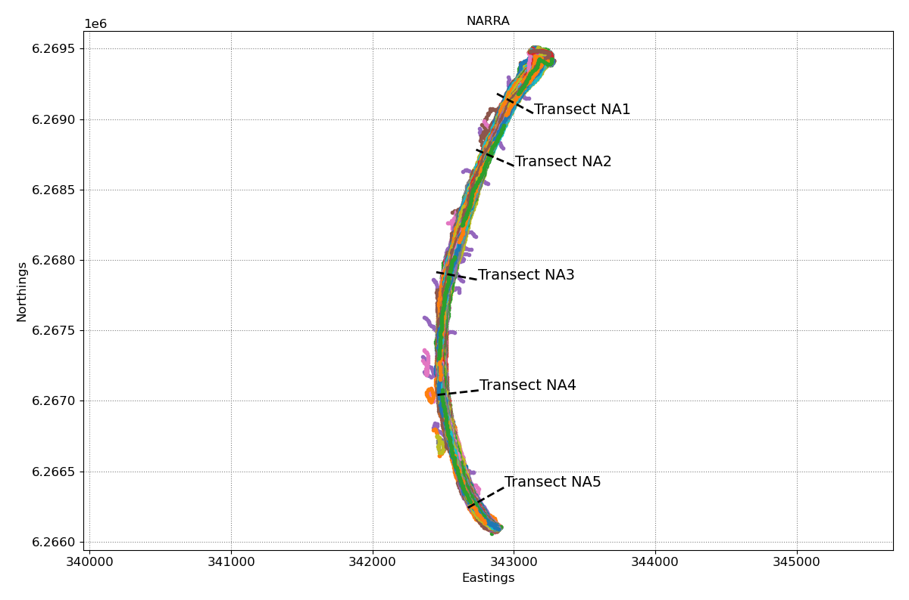
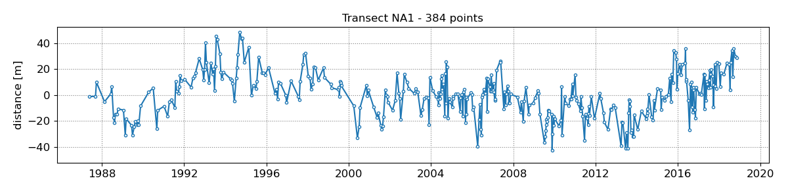
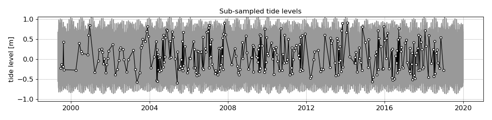
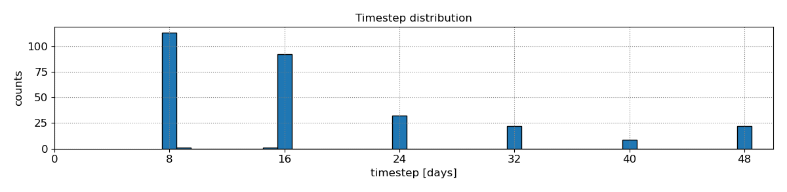
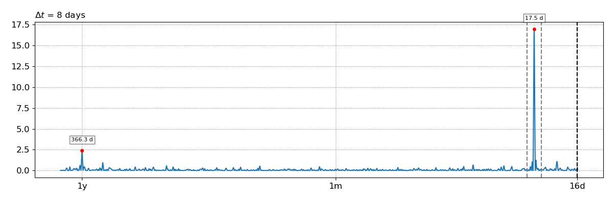
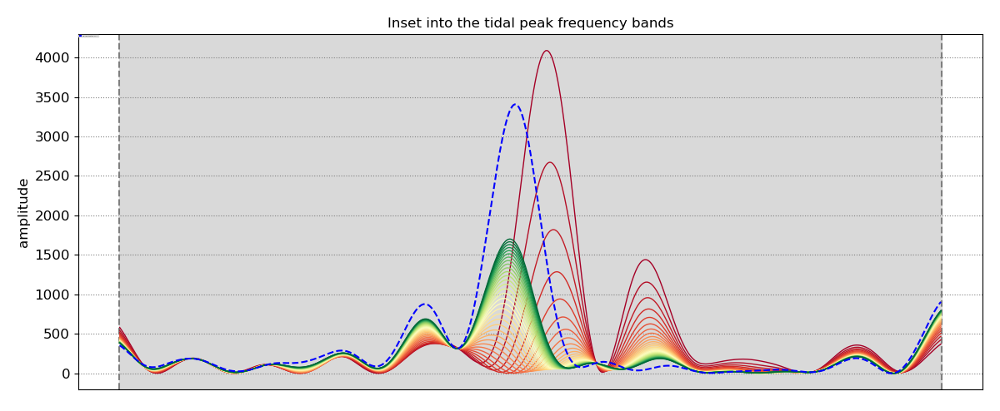
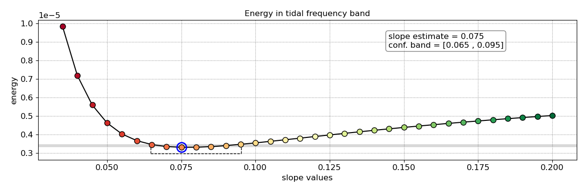
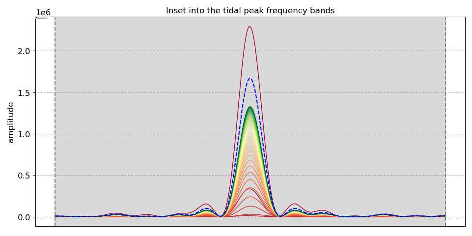
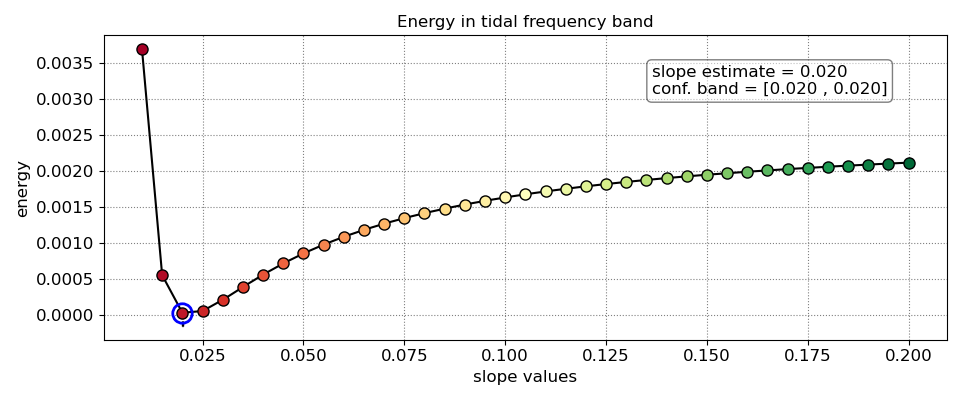

# CoastSat.slope
### Beach slope estimation from satellites
This toolkit enables users to estimate the beach-face slope from satellite-derived shorelines and associated tide levels. As shown below, beach-face slopes can vary drastically for different coastlines. As the horizontal tidal excursion is modulated by this slope, we can capture such modulation with instantaneous satellite-derived shorelines and associated water levels in order to estimate this slope. Here we use [CoastSat](https://github.com/kvos/CoastSat) to map the shorelines and [FES2014](https://www.aviso.altimetry.fr/es/data/products/auxiliary-products/global-tide-fes/description-fes2014.html) to obtain tide levels, but the method could be applied to other data sources.

**If you like the repo put a star on it!**
### Ressources
The methodology is described in: Vos K., Harley M.D., Splinter K.D., Walker A., Turner I.L. (2019). Beach slopes from satellite-derived shorelines. Geophysical Research Letters. https://doi.org/10.1029/2020GL088365 (or preprint [here](https://www.essoar.org/doi/10.1002/essoar.10502903.1)). Slides describing the method are also available [here](https://www.slideshare.net/KilianVos/beach-slopes-from-satellite-shorelines-coast2coast-presentation).

You can visit the [CoastSat webGIS page](http://coastsat.wrl.unsw.edu.au/) to explore and download a regional-scale dataset of beach slopes.

In the repo, there are two Jupyter Notebooks showing examples of beach slope estimation along transects at [Cable Beach](https://github.com/kvos/CoastSat.slope/blob/master/example_slope_Cable_beach.ipynb) and [Narrabeen-Collaroy](https://github.com/kvos/CoastSat.slope/blob/master/example_slope_Narrabeen.ipynb), Australia.

### Installation

To run the examples you will need to install the `coastsat` environment (instructions in the main [CoastSat toolbox](https://github.com/kvos/CoastSat)).

If you want to use [FES2014](https://www.aviso.altimetry.fr/es/data/products/auxiliary-products/global-tide-fes/description-fes2014.html) global tide model to get the tide levels at the time of image acquisition, follow the [instructions](https://github.com/kvos/CoastSat.slope/blob/master/doc/FES2014_installation.md) provided to setup the model.

### Example

The different steps to obtain a beach slope estimate are shown here with an example at Narrabeen-Collaroy.

Shorelines were mapped with the [CoastSat toolbox](https://github.com/kvos/CoastSat)) from Landsat 5, Landsat 7 and Landsat 8 images covering the site. These are provided here in the same format as CoastSat outputs them (under `/example_data/NARRA_output.pkl`).

The next step is to compute the intersections between instantaneous shorelines and cross-shore transects to obtain time-series (note that a few outlier removal functions have been added here to make sure that the time-series are clean before using them for slope estimation).

Once we have the shoreline time-series, we need to retrieve the tide levels associated with each date (date at which the image was acquired). This can be done by loading a .csv file with tide data or by extracting modelled tides at this location from the [FES2014](https://www.aviso.altimetry.fr/es/data/products/auxiliary-products/global-tide-fes/description-fes2014.html) global tide model. Below we show the overall tidal variations in Sydney and the tide levels at the time of image acquisition.

It is important to check what is the minimum timestep between images as this will define our Nyquist limit in the frequency domain analysis. For example, here we consider the period between 1999 (launch of L7) and 2020 where we know that we have 2 Landsat satellites simultaneously in orbit and, as each satellite has a revisit period of 16 days, our minimum sampling period is 8 days (-> Nyquist limit is 16 days).  

Once we have defined the Nyquist limit (or minimum sampling period, `settings_slope['n_days']` parameter), we can use the sub-sampled tide level time-series to construct a power spectrum density with the Lombscargle transform (equivalent Fourier transform for unevenly sampled datasets) and identify the peak tidal frequency in these time-series.

The last step is to apply a tidal correction to the shoreline time-series with a range of slopes, construct the power spectrum density for each tidally-corrected time-series and find the slope that minimises the amount of energy (integral of power spectrum density) inside the peak tidal frequency band previously identified. As you can see in the energy vs slope curve below, the minimum of the curve may not be sharply defined so a confidence band (slopes within 5% of minimum) is also provided with the slope estimate.  

The accurcacy of the slope estimates, as demonstrated in the [published work](https://doi.org/10.1029/2020GL088365), depends on the signal-to-noise ratio between the horizontal tidal excursion and the measurement accuracy of the satellite-derived shorelines. At sites with larger tidal excursion signals, like Cable Beach (mean spring tidal range of 8 m), the modulation by the slope will be better captured in the tidal frequency band and result in well-defined minimums along the energy curve as shown below.

I recommend following both Jupyter Notebooks provided here (~10 min each), the [Narrabeen-Collaroy](https://github.com/kvos/CoastSat.slope/blob/master/example_slope_Narrabeen.ipynb) one (tide range of 1.3 m) and the [Cable Beach](https://github.com/kvos/CoastSat.slope/blob/master/example_slope_Cable_beach.ipynb) one (tide range of 8 m) to get a feel for how the power spectrum densities and energy curves behave before running it at your own site. 
Happy beach slope mapping !

Having a problem? Post an issue in the [Issues page](https://github.com/kvos/CoastSat.slope/issues) (please do not email).
