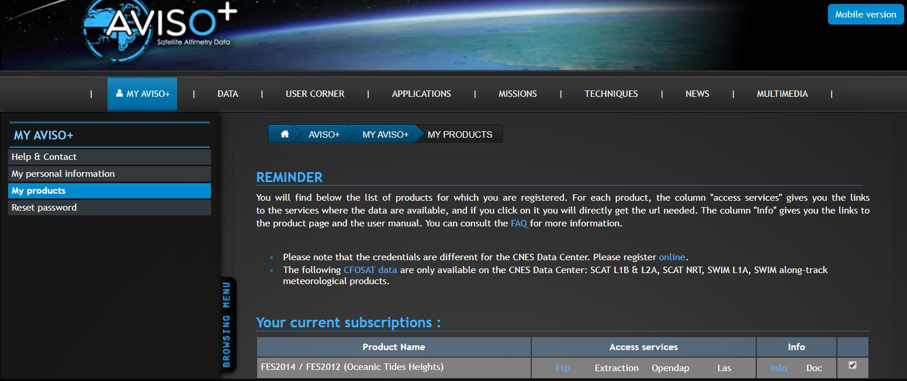
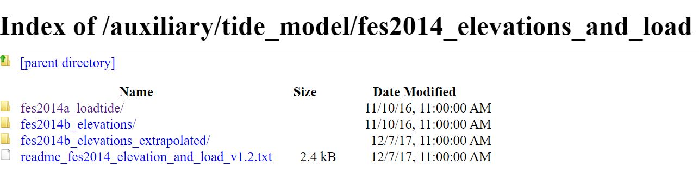

#### How to install FES2014 on Windows:

1. Download the source folder from Bitbucket: https://bitbucket.org/fbriol/fes/downloads/ - unzip it and store in any preferred location.

2. Download the **FES2014 Oceanic Tide Heights** dataset from the [Aviso+ website](https://www.aviso.altimetry.fr/data.html) [accout required].

3. From the ftp server download the `fes2014a_loadtide/` (1.3GB) and `fes2014b_elevations/` (1.8GB) folders.

4. Unzip the folders (twice .xz and .tar) and save both folders (`load_tide`and `ocean_tide`) in your source folder at the following location `fes-2.9.1-Source\data\fes2014\`. After you completed this step, that folder should look like this, with only `load_tide` and `ocean_tide` folders containing 34 .nc files each and the other folders left empty:

5. Update the .ini files (`load_tide.ini` and `ocean_tide.ini`) to include for each tidal component the absolute path to the corresponding .nc file (use find and replace to do this). It should look like this:

6. Open the Anaconda prompt and activate your environment, then run: `conda install -c fbriol fes`

7. To test if the installation was successful, type `python` and then `import pyfes`
